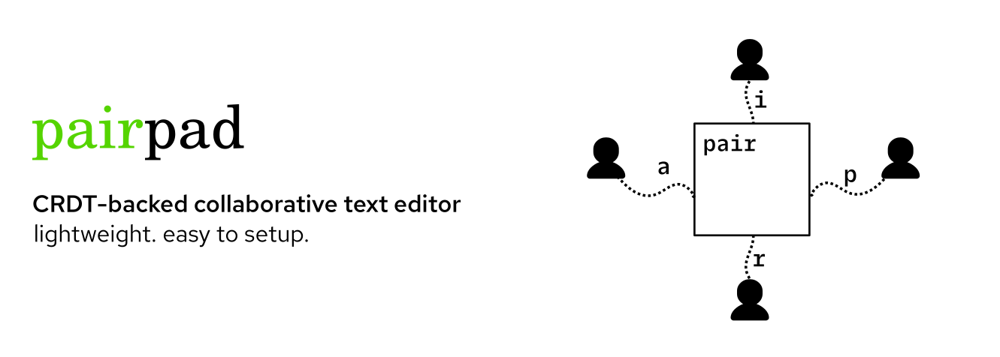

# pairpad

A collaborative text editor written in Go.


## Features

- Lightweight (~4MB)
- Easy to setup (single binary, Docker/Fly setup available!)
- Export/import document content! (see [keybindings](#keybindings))

## Keybindings

| Action         | Key |
|--------------|:-----:|
| Exit |  `Esc`, `Ctrl+C` |
| Save to document |  `Ctrl+S` |
| Load from document |  `Ctrl+L` |
| Move cursor left |  `Left arrow key`, `Ctrl+B` |
| Move cursor right |  `Right arrow key`, `Ctrl+F` |
| Move cursor up |  `Up arrow key`, `Ctrl+P` |
| Move cursor down |  `Down arrow key`, `Ctrl+N` |
| Move cursor to start |  `Home` |
| Move cursor to end |  `End` |
| Delete characters |  `Backspace`, `Delete` |

## Usage

The easiest way to get started is to download `pairpad` from the [releases](https://github.com/burntcarrot/pairpad/releases).

Then start a server:

```
./pairpad-server
```

```
Usage of pairpad-server:
  -addr string
        Server's network address (default ":8080")
```

Then start a client:

```
./pairpad
```

```
Usage of pairpad:
  -debug
        Enable debugging mode to show more verbose logs
  -file string
        The file to load the pairpad content from
  -login
        Enable the login prompt for the server
  -secure
        Enable a secure WebSocket connection (wss://)
  -server string
        The network address of the server (default "localhost:8080")
```

Example usage would be:

- Connect to a server: `pairpad -server pairpad.test`
- Enable login prompt: `pairpad -server pairpad.test -login`
- Specify a file to save to/load from: `pairpad -server pairpad.test -file example.txt`
- Enable debugging mode: `pairpad -server pairpad.test -debug`

### Local setup

To start the server:

```
go run server/main.go
```

To start the client:

```
go run client/*.go
```

(spin up at least 2 clients - it's a collaborative editor! Also works with a single client.)

## Deployment

The easiest way to deploy would be use to [fly.io](https://fly.io/).

[fly.io](https://fly.io/) has an [amazing guide](https://fly.io/docs/hands-on/) to get started!

Here's the `Dockerfile`:

```Dockerfile
FROM golang:1.18-alpine

WORKDIR /app

COPY go.mod ./
COPY go.sum ./
RUN go mod download

COPY ./ ./

RUN apk add --no-cache bash && go build -o ./pairpad-server ./server/main.go

EXPOSE 8080

CMD [ "/app/pairpad-server" ]
```

Here's a sample `fly.toml` file:

```toml
app = "pairpad-server-<YOUR_NAME>"
kill_signal = "SIGINT"
kill_timeout = 5
processes = []

[env]

[experimental]
  allowed_public_ports = []
  auto_rollback = true

[[services]]
  http_checks = []
  internal_port = 8080
  processes = ["app"]
  protocol = "tcp"
  script_checks = []
  [services.concurrency]
    hard_limit = 25
    soft_limit = 20
    type = "connections"

  [[services.ports]]
    force_https = true
    handlers = ["http"]
    port = 80

  [[services.ports]]
    handlers = ["tls", "http"]
    port = 443

  [[services.tcp_checks]]
    grace_period = "1s"
    interval = "15s"
    restart_limit = 0
    timeout = "2s"
```

## How does it work?

Here's a basic explanation:

- Each client has a CRDT-backed local state (document).
- The CRDT has a `Document` which can be represented by a sequence of characters with some attributes.
- The server is responsible for:
  - establishing connections with the client
  - maintaining a list of active connections
  - broadcasting operations sent from a client to other clients
- Clients connect to the server and send operations to the server.
- The TUI is responsible for:
  - Rendering document content
  - Handling key events
  - Generating payload on key presses
  - Dispatching generated payload to the server

## License

`pairpad` is licensed under the [MIT license](LICENSE).

## Future plans

Text editors is a huge space - there's lots of improvements to be made!
